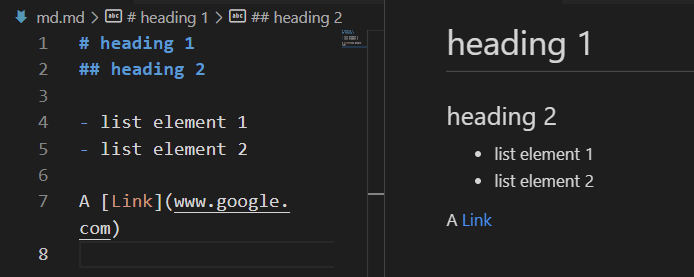
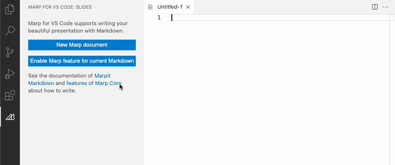
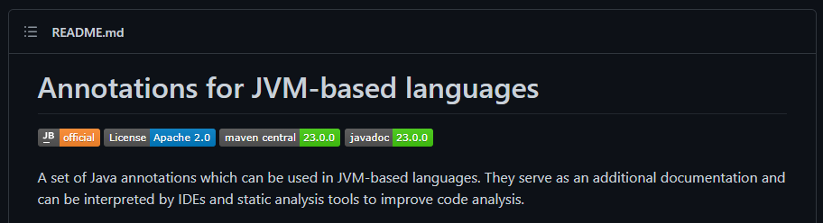

## Foreword
My blog posts weigh heavily on diagrammatic information; they are not intended to be read without the included visual prompts. If you cannot see the non-text content please refer to the image alt-text.

# The strengths of Markdown (title WIP)
Markdown is a brilliant tool for quickly writing up universally accessible documents.
Created by John Gruber and Aaron Schwartz in 2004, it stands as one of the most popular and widely used markup languages
([site](https://en.wikipedia.org/wiki/Markup_language))
 around.
 Quick and simple formatting that can be read plainly makes it a great tool for many applications.
 Personally, I believe it's greatest strength to most people is through using it as a note-taking tool.

> "*A Markdown-formatted document should be publishable as-is, as plain text, without looking like it’s been marked up with tags or formatting instructions*"
John Gruber, creator of Markdown.
[Source](https://daringfireball.net/projects/markdown/syntax)

A Markdown file can be used for just a quick to do list, written and looked at exclusively in it's raw form.
But it can also be a well organized and formatted ideas space, documentation and a range of other things once utilized correctly.

## Core Tools in the base Markdown Language
Markdown comes with a myriad of syntax rules for organizing
By far the three most common tools you will use when writing in Markdown are lists, links and headings.



Adding these three components to your document is fast, easy and very legible.
Typically when I write meeting notes, quick checklists or timeboxed research these 3 tools are all I use.
And being able to simply copy and paste the text to another space (a key strength of all markup languages) removes any formatting issues experienced with more sophisticated text editors.

## Markdown flavours

As more people began to use Markdown for more bespoke documents, the demand for specific features in the language grew. Enter Markdown flavours - a range of extensions on the language increasing it's capabilities and utility.

When Markdown was released the syntax was not specified unambiguously. Often documents would render differently in different systems due to different interpretations of Markdown's rule set. [CommonMark](https://commonmark.org/) is a modern day solution to this ambiguity, specifying a standard specification for users of Markdown. This allowed easy transfer of Markdown to different systems and safe extensibility of the syntax.

 The most common example developers encounter these days is [the GitHub Markdown flavour](https://github.github.com/gfm/), a superset of the CommonMark specification. This flavour adds many useful changes relevant to the software world. A common example is highlighting for a range of programming languages within the Markdown code blocks. By simply adding the language to the start of the block, code snippets can be coloured and formatted as the language would.

```
```language
\```
```

Other additional tools include [checklist items](https://github.github.com/gfm/#task-list-items-extension-) that can be interactively checked off post rendering and text strikethrough for clearly deprecating comments or wording without removing it. As a Markdown flavour, the GitHub flavour interpreter is able to successfully compile these features to HTML for use on GitHub.

## So if Gruber's Markdown syntax is extendable, what are people creating with it?

Markdown was designed to be compiled to HTML as it's primary function. This makes it great for static websites such as blogs and documentation. Static site builders like [Hugo](https://gohugo.io/) and [Jekyll](https://jekyllrb.com/) take this a step further, enabling easy and quick site building. With almost no handwritten HTML and Markdown files with content and styling rules, static websites can be quickly created with these tools.

Markdown can also be used to create presentations using [Marp](https://github.com/marp-team/marp). Additional rules are included to dictate the structure and look of the presentation, with all the styling content and slide transition preferences contained within a single `.md`!



All GitHub repositories include a Markdown `README.md`. Alongside all other extra syntax rules included with the GitHub flavour, these Markdown files support additional community-made widgets, or "shields". These can display information such as page traffic, package versioning. A good example of one of these tools is the [visitors badge](https://www.visitorbadge.io/). For a look at lots set up shield applications see [shields.io](https://shields.io/).




- Make print-ready documents like documents in Word or Publisher


- Showdownjs: https://github.com/showdownjs/showdown

## The good
- Used by lots of people, learn once used everywhere
- Readable when raw (unlike HTML)
- Platform independent
- As someone who had to write technical reports in uni in LaTeX, it's much nicer. Much more predictable behaviour, simpler syntax, more widely used

## The bad
- Unstandardised in it's creation
  - community attempts to standardise [Like CommonMark](https://commonmark.org/)

## Other notes
- The presentation could have gifs of each tool used in Atom with the rendered Markdown on the RHS
- Should do an external question submission page, show at beginning of the talk and when revealing the presentation was itself a Markdown file, switch to it and answer questions (a bit more subtle than messages in the teams chat)

## Sources & saved links
- [Intro overview](https://document360.com/blog/introductory-guide-to-markdown-for-documentation-writers/#:~:text=Some%20of%20the%20many%20uses,and%20StackExchange%2C%20among%20many%20others.)
- [CommonMark](https://commonmark.org/)
- [Markdown Flavours](https://github.com/commonmark/commonmark-spec/wiki/markdown-flavors)
- [Reddit Markdown](https://www.reddit.com/wiki/markdown/)


